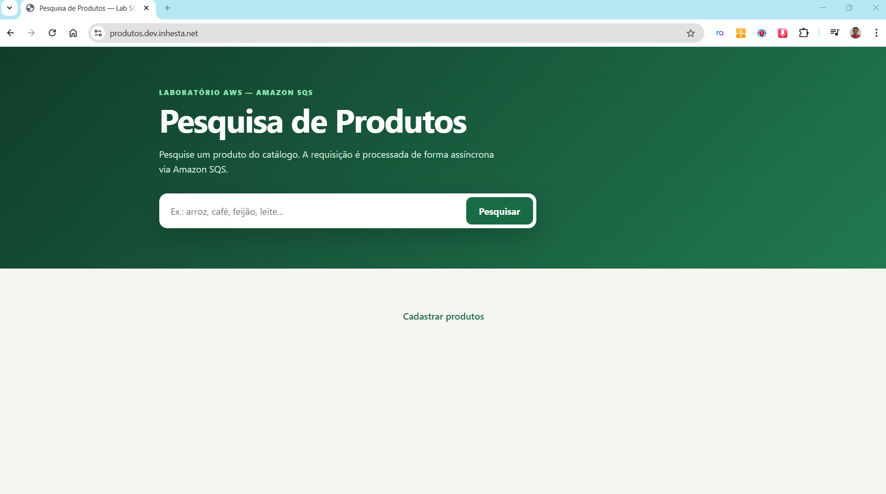
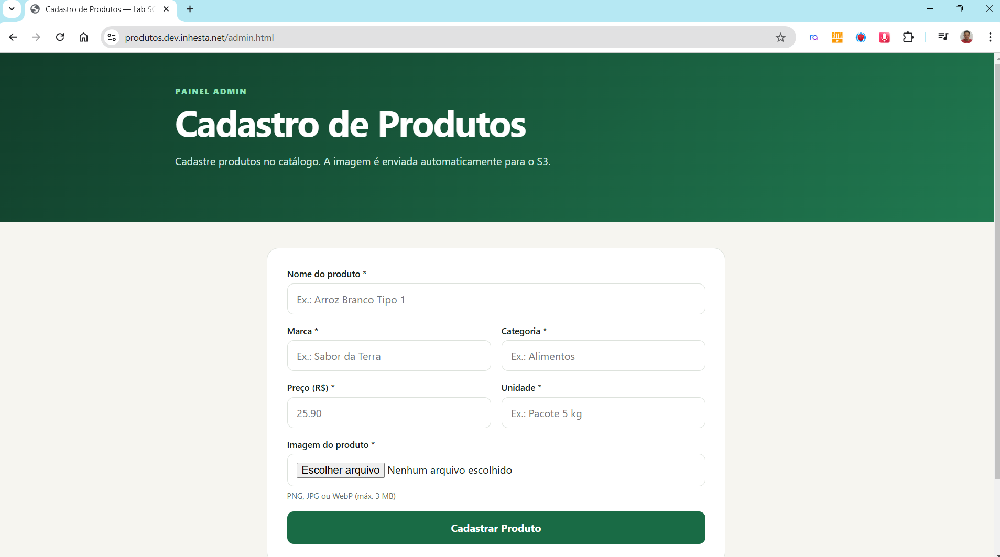
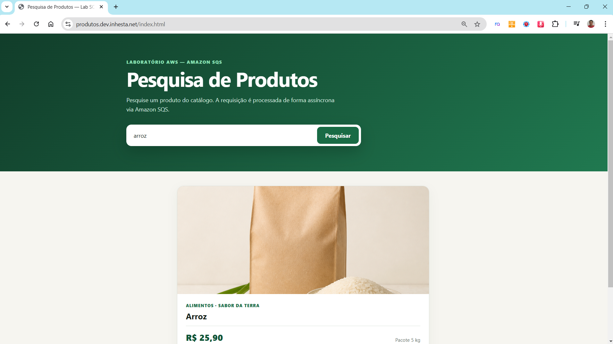
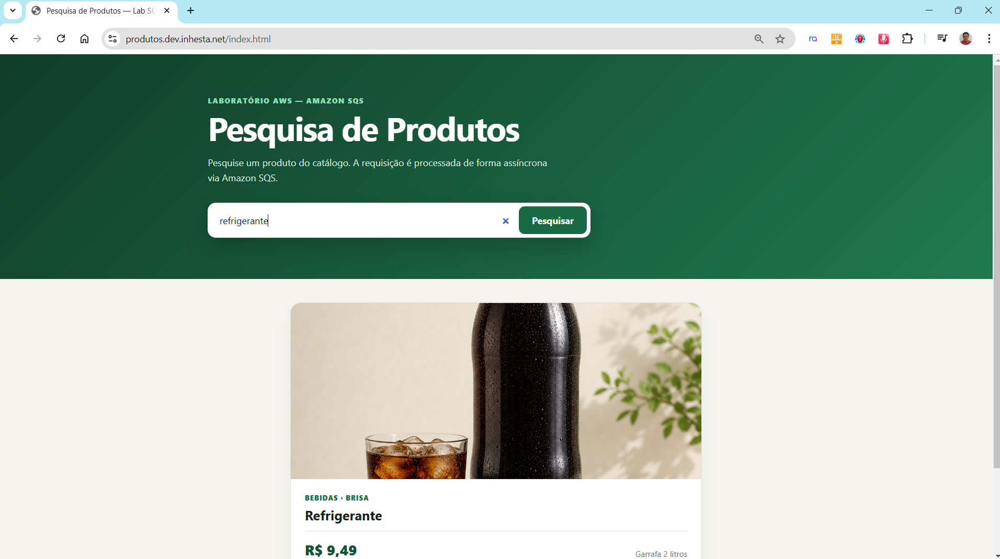
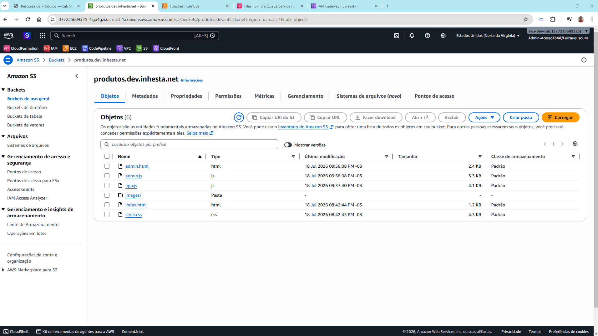

# Amazon SQS — Processamento Assíncrono de Mensagens

---

## Resumo

Este laboratório demonstra na prática o uso do **Amazon SQS (Simple Queue Service)** para implementar um sistema de processamento assíncrono de mensagens na AWS. Construímos uma aplicação de e-commerce simplificada onde o usuário pesquisa produtos em um catálogo, e a busca é processada de forma assíncrona usando filas SQS — seguindo o padrão **Produtor/Consumidor**.

O lab cobre os principais conceitos de mensageria: desacoplamento de serviços, processamento assíncrono, retry automático, Dead Letter Queue (DLQ), visibilidade de mensagens e Partial Batch Response.

.png)

---

## Sobre o Laboratório

### Objetivo

Ensinar como utilizar o Amazon SQS para desacoplar componentes de uma aplicação serverless, garantindo resiliência, escalabilidade e tolerância a falhas no processamento de mensagens.

### O que você vai aprender

- Criar e configurar filas SQS (Standard e Dead Letter Queue)
- Implementar o padrão Produtor/Consumidor com Lambda e SQS
- Configurar retry automático e políticas de DLQ
- Usar DynamoDB como banco de dados para estados de processamento
- Integrar API Gateway, Lambda, SQS e DynamoDB em um fluxo serverless completo
- Implementar polling no frontend para acompanhar processamento assíncrono

### Serviços AWS utilizados

| Serviço | Função no projeto |
|---------|-------------------|
| **Amazon SQS** | Fila de mensagens que desacopla produtor e consumidor |
| **AWS Lambda** | 4 funções: cadastro, produtora, consumidora e consulta |
| **Amazon DynamoDB** | 2 tabelas: catálogo de produtos e pesquisas |
| **Amazon S3** | Hospedagem do frontend estático e imagens |
| **Amazon API Gateway** | Endpoints REST (HTTP API) |
| **AWS IAM** | Roles e permissões para as Lambdas |

### Pré-requisitos

- Conta AWS ativa
- Conhecimentos básicos do console AWS
- Bucket S3 configurado para hospedagem de site estático

<p align="center">
  
  
  
</p>
<p align="center">
  
  
</p>

---

## Descrição do Projeto

O projeto simula uma loja online com pesquisa de produtos. A arquitetura é dividida em duas partes:

### Parte 1 — Catálogo de Produtos (preparação)

Um painel administrativo (`admin.html`) permite cadastrar produtos com nome, marca, categoria, preço e imagem. A Lambda de cadastro salva os dados no DynamoDB e gera uma URL pré-assinada para upload da imagem no S3.

### Parte 2 — Pesquisa Assíncrona com SQS (foco principal)

Quando o usuário pesquisa um produto no frontend (`index.html`):

1. **Lambda Produtora** recebe a requisição, grava um registro com status `PENDING` no DynamoDB e envia uma mensagem para a fila SQS. Responde imediatamente com HTTP 202 (Accepted).
2. **Amazon SQS** armazena a mensagem e aciona a Lambda Consumidora via trigger automático.
3. **Lambda Consumidora** processa a mensagem: busca o produto no catálogo e atualiza o registro no DynamoDB para `COMPLETED` (com dados do produto) ou `NOT_FOUND`.
4. **Frontend** faz polling na **Lambda de Consulta**, que lê o DynamoDB até obter o resultado final.

Se a Lambda Consumidora falhar, o SQS reentrega a mensagem automaticamente (até 3 vezes). Após 3 falhas, a mensagem é movida para a **Dead Letter Queue (DLQ)** para análise posterior.

---

## Diagrama de Arquitetura

.png)

---

## Fluxo de Dados (Sequência)

```
 Usuário          Frontend         API GW       Produtora        SQS         Consumidora      DynamoDB
    │                │                │              │             │               │               │
    │  pesquisa      │                │              │             │               │               │
    │  "arroz"       │                │              │             │               │               │
    │───────────────►│                │              │             │               │               │
    │                │  POST /pesq.   │              │             │               │               │
    │                │───────────────►│──────────────►             │               │               │
    │                │                │              │──── PENDING ─────────────────────────────────►
    │                │                │              │             │               │               │
    │                │                │              │── msg ─────►│               │               │
    │                │                │              │             │               │               │
    │                │  202 Accepted  │              │             │               │               │
    │                │◄───────────────│◄─────────────│             │               │               │
    │  "Processando" │                │              │             │               │               │
    │◄───────────────│                │              │             │               │               │
    │                │                │              │             │── trigger ───►│               │
    │                │                │              │             │               │── GetItem ────►
    │                │                │              │             │               │◄── produto ───│
    │                │                │              │             │               │── COMPLETED──►│
    │                │                │              │             │               │               │
    │                │  GET /pesq/{id}│              │             │               │               │
    │                │───────────────►│──────────────────────────────────────────────── GetItem ───►
    │                │◄───────────────│◄─────────────────────────────────────────────── resultado ─│
    │  resultado     │                │              │             │               │               │
    │◄───────────────│                │              │             │               │               │
```

---

# Guia de Implantação

---

# PARTE 1 — Preparando o ambiente (cadastro de produtos)

Nesta parte, criamos a base que já vai estar pronta antes de demonstrar o SQS.

---

## 1.1 — Criar tabela DynamoDB para o catálogo

1. **DynamoDB** → **Criar tabela**
2. Nome: `catalogo-produtos`
3. Chave de partição: `slug` (String)
4. Modo de capacidade: **Sob demanda**
5. Criar tabela

.png)

---

## 1.2 — Configurar CORS no bucket S3

O bucket do frontend já existe com o site publicado.

Aba **Permissões** → **CORS** → adicionar:

```json
[
  {
    "AllowedHeaders": ["*"],
    "AllowedMethods": ["PUT"],
    "AllowedOrigins": ["*"],
    "ExposeHeaders": [],
    "MaxAgeSeconds": 300
  }
]
```

---

## 1.3 — Criar role para a Lambda de cadastro

1. **IAM** → **Funções** → **Criar função** → Lambda
2. Nome: `lambda-cadastro-role`
3. Política gerenciada: `AWSLambdaBasicExecutionRole`
4. Criar → Adicionar política em linha:

```json
{
  "Version": "2012-10-17",
  "Statement": [
    {
      "Effect": "Allow",
      "Action": "dynamodb:PutItem",
      "Resource": "arn:aws:dynamodb:SUA_REGIAO:SEU_ACCOUNT_ID:table/catalogo-produtos"
    },
    {
      "Effect": "Allow",
      "Action": "s3:PutObject",
      "Resource": "arn:aws:s3:::SEU_BUCKET/images/*"
    }
  ]
}
```

> Substitua `SUA_REGIAO` pela região (ex: us-east-1), `SEU_ACCOUNT_ID` pelo ID da conta (12 dígitos) e `SEU_BUCKET` pelo nome do seu bucket S3.

---

## 1.4 — Criar Lambda de cadastro

1. **Lambda** → **Criar função**
2. Nome: o nome que quiser (ex: `cadastro-produto`)
3. Runtime: Python 3.12
4. Role: `lambda-cadastro-role`
5. **IMPORTANTE — Configurar o código:**
   - Na aba Código, o arquivo padrão vem como `lambda_function.py` — **delete esse arquivo**
   - Crie um novo arquivo chamado **`app.py`** (File → New File)
   - Cole o conteúdo de `src/cadastro/app.py`
   - Clique em **Deploy**
6. **IMPORTANTE — Configurar o handler:**
   - Role para baixo até **Configurações do runtime**
   - Clique em **Editar**
   - Mude o handler para: **`app.lambda_handler`**
   - Salvar
7. Timeout: 10 segundos
8. Variáveis de ambiente:
   - `CATALOGO_TABLE` = `catalogo-produtos`
   - `IMAGES_BUCKET` = nome do seu bucket S3
   - `IMAGES_PREFIX` = `images/produtos/`


.png)
---

## 1.5 — Criar rota no API Gateway

1. **API Gateway** → criar ou usar HTTP API existente
2. Criar rota: **POST /produtos** → integração com Lambda `cadastro-produto`
3. CORS:
   - Allow-Origin: `*`
   - Allow-Methods: `GET, POST, OPTIONS`
   - Allow-Headers: `Content-Type`

.png)

---

## 1.6 — Atualizar frontend e cadastrar produtos

1. Editar `admin.js` — colocar URL da API:
```javascript
const API_URL = "URL_DO_SEU_API_GATEWAY";
```

2. Fazer upload de `admin.html`, `admin.js` e `style.css` no S3

3. Acessar `admin.html` e cadastrar os 10 produtos:

| Nome | Marca | Categoria | Preço | Unidade | Imagem |
|------|-------|-----------|-------|---------|--------|
| Arroz | Sabor da Terra | Alimentos | 25.90 | Pacote 5 kg | arroz.png |
| Feijao | Sabor da Terra | Alimentos | 8.99 | Pacote 1 kg | feijao.png |
| Leite | Fazenda Clara | Bebidas | 5.49 | Caixa 1 litro | leite.png |
| Cafe | Serra Alta | Bebidas | 18.90 | Pacote 500 g | cafe.png |
| Acucar | Doce Lar | Alimentos | 4.79 | Pacote 1 kg | acucar.png |
| Refrigerante | Brisa | Bebidas | 9.49 | Garrafa 2 litros | refrigerante.png |
| Macarrao | Casa Italiana | Alimentos | 5.29 | Pacote 500 g | macarrao.png |
| Oleo | Cozinha Leve | Alimentos | 7.69 | Garrafa 900 ml | oleo.png |
| Farinha | Moinho Real | Alimentos | 6.39 | Pacote 1 kg | farinha.png |
| Sal | Mar Azul | Alimentos | 2.89 | Pacote 1 kg | sal.png |

4. Verificar no DynamoDB que os 10 itens estão na tabela `catalogo-produtos`
5. Verificar no S3 que as imagens estão em `images/produtos/`

**Ao final da Parte 1, temos:** catálogo de produtos pronto no DynamoDB com imagens no S3.

---
---

# PARTE 2 — Criando os recursos do SQS (foco do laboratório)

Agora vamos criar o fluxo assíncrono com Amazon SQS. Esta é a parte principal do lab.

---

## O que vamos construir

```
Pesquisa no frontend
       ↓
  API Gateway (POST /pesquisas)
       ↓
  Lambda Produtora
       ↓ grava PENDING no DynamoDB
       ↓ envia mensagem para a fila
  Amazon SQS (pesquisa-produtos-fila)
       ↓ trigger automático
  Lambda Consumidora
       ↓ busca produto no catálogo
       ↓ atualiza DynamoDB (COMPLETED ou NOT_FOUND)
       
  Frontend faz polling (GET /pesquisas/{searchId})
       ↓
  Lambda Consulta → lê DynamoDB → retorna resultado
```

---

## 2.1 — Criar tabela DynamoDB para pesquisas

1. **DynamoDB** → **Criar tabela**
2. Nome: `pesquisas-produtos`
3. Chave de partição: `searchId` (String)
4. Modo de capacidade: **Sob demanda**
5. Criar tabela

.png)
.png)


---

## 2.2 — Criar filas SQS

### Dead Letter Queue (criar primeiro)

1. **SQS** → **Criar fila**
2. Tipo: **Standard**
3. Nome: `pesquisa-produtos-dlq`
4. Período de retenção: **14 dias**
5. Criptografia: **SSE-SQS**
6. Criar fila

### Fila principal

1. **SQS** → **Criar fila**
2. Tipo: **Standard**
3. Nome: `pesquisa-produtos-fila`
4. Tempo limite de visibilidade: **90 segundos**
5. Criptografia: **SSE-SQS**
6. Política de fila de mensagens mortas:
   - Ativar
   - Fila: `pesquisa-produtos-dlq`
   - Máximo de recebimentos: **3**
7. Criar fila

.png)
.png)
.png)

---

## 2.3 — Criar IAM Roles

### Role: `lambda-produtor-role`

1. **IAM** → **Funções** → **Criar função** → Lambda
2. Política gerenciada: `AWSLambdaBasicExecutionRole`
3. Criar → Adicionar política em linha:

```json
{
  "Version": "2012-10-17",
  "Statement": [
    {
      "Effect": "Allow",
      "Action": "sqs:SendMessage",
      "Resource": "arn:aws:sqs:SUA_REGIAO:SEU_ACCOUNT_ID:pesquisa-produtos-fila"
    },
    {
      "Effect": "Allow",
      "Action": "dynamodb:PutItem",
      "Resource": "arn:aws:dynamodb:SUA_REGIAO:SEU_ACCOUNT_ID:table/pesquisas-produtos"
    }
  ]
}
```

> Substitua `SUA_REGIAO` pela região (ex: us-east-1) e `SEU_ACCOUNT_ID` pelo ID da conta (12 dígitos).
>
> **Como encontrar o ARN da tabela:** DynamoDB → Tabelas → clique na tabela → aba "Visão geral" → copie o "ARN da tabela do Amazon Resource Name".
>
> **Como encontrar o ARN da fila:** SQS → clique na fila → copie o "ARN" nos detalhes da fila.
>
> **Como encontrar o Account ID:** Clique no nome da conta no canto superior direito → o número de 12 dígitos é o Account ID.

### Role: `lambda-consumidor-role`

1. Políticas gerenciadas: `AWSLambdaBasicExecutionRole` + `AWSLambdaSQSQueueExecutionRole`
2. Política em linha:

```json
{
  "Version": "2012-10-17",
  "Statement": [
    {
      "Effect": "Allow",
      "Action": "dynamodb:UpdateItem",
      "Resource": "arn:aws:dynamodb:SUA_REGIAO:SEU_ACCOUNT_ID:table/pesquisas-produtos"
    },
    {
      "Effect": "Allow",
      "Action": "dynamodb:GetItem",
      "Resource": "arn:aws:dynamodb:SUA_REGIAO:SEU_ACCOUNT_ID:table/catalogo-produtos"
    }
  ]
}
```

### Role: `lambda-consulta-role`

1. Política gerenciada: `AWSLambdaBasicExecutionRole`
2. Política em linha:

```json
{
  "Version": "2012-10-17",
  "Statement": [
    {
      "Effect": "Allow",
      "Action": "dynamodb:GetItem",
      "Resource": "arn:aws:dynamodb:SUA_REGIAO:SEU_ACCOUNT_ID:table/pesquisas-produtos"
    }
  ]
}
```

---

## 2.4 — Criar as 3 Lambdas

> **IMPORTANTE:** Em todas as Lambdas:
> - O arquivo de código deve se chamar **`app.py`** (não `lambda_function.py`)
> - O handler deve ser **`app.lambda_handler`** (não `lambda_function.lambda_handler`)
> - Após colar o código, clique em **Deploy**
> - O nome da Lambda pode ser qualquer um que você quiser (os nomes abaixo são sugestões)

### Lambda: `produtor-pesquisa`

- Nome: o nome que quiser (ex: `produtor-pesquisa`)
- Role: `lambda-produtor-role`
- Código: colar conteúdo de `src/produtor/app.py` no arquivo **`app.py`**
- Handler: **`app.lambda_handler`**
- Timeout: **10 segundos**
- Variáveis de ambiente:
  - `QUEUE_URL` = URL da fila `pesquisa-produtos-fila` (copie do SQS → Detalhes da fila → URL)
  - `TABLE_NAME` = `pesquisas-produtos`

### Lambda: `consumidor-pesquisa`

- Nome: o nome que quiser (ex: `consumidor-pesquisa`)
- Role: `lambda-consumidor-role`
- Código: colar conteúdo de `src/consumidor/app.py` no arquivo **`app.py`**
- Handler: **`app.lambda_handler`**
- Timeout: **30 segundos**
- Variáveis de ambiente:
  - `TABLE_NAME` = `pesquisas-produtos`
  - `CATALOGO_TABLE` = `catalogo-produtos`
- **Gatilho SQS:**
  - Fila: `pesquisa-produtos-fila`
  - Tamanho do lote: **10**
  - Ativar gatilho: **Sim**
  - Reportar falhas de item em lote: **Sim**

### Lambda: `consulta-pesquisa`

- Nome: o nome que quiser (ex: `consulta-pesquisa`)
- Role: `lambda-consulta-role`
- Código: colar conteúdo de `src/consulta/app.py` no arquivo **`app.py`**
- Handler: **`app.lambda_handler`**
- Timeout: **10 segundos**
- Variáveis de ambiente:
  - `TABLE_NAME` = `pesquisas-produtos`

.png)
.png)
.png)
.png)

---

## 2.5 — Criar rotas no API Gateway

Adicionar na mesma HTTP API:

| Método | Caminho | Lambda |
|--------|---------|--------|
| POST | `/pesquisas` | `produtor-pesquisa` |
| GET | `/pesquisas/{searchId}` | `consulta-pesquisa` |

.png)
.png)

---

## 2.6 — Atualizar frontend de pesquisa

1. Editar `app.js` — colocar URL da API:
```javascript
const API_URL = "URL_DO_SEU_API_GATEWAY";
```

2. Fazer upload de `index.html`, `app.js` e `style.css` no S3
3. Invalidar CloudFront (`/*`) se necessário

---
---

# TESTES — O que vamos demonstrar

---

## Teste 1: Pesquisa normal (fluxo completo do SQS)

1. Acesse `index.html`
2. Digite `arroz` e clique **Pesquisar**
3. A tela mostra "Processando..." enquanto o SQS trabalha
4. Após ~4 segundos, o resultado aparece com imagem

**O que aconteceu:**
- Lambda Produtora gravou PENDING + enviou mensagem para a fila
- SQS entregou para a Lambda Consumidora
- Lambda Consumidora buscou no catálogo e atualizou para COMPLETED
- Frontend detectou via polling e mostrou o resultado

---

## Teste 2: Produto não encontrado

1. Pesquise `chocolate` (não existe no catálogo)
2. Resultado: "Produto não encontrado" (status NOT_FOUND)

---

## Teste 3: Retry e Dead Letter Queue

1. Pesquise `erro`
2. A Lambda Consumidora lança exceção proposital
3. O SQS tenta 3 vezes (a cada 90 segundos)
4. Após 3 falhas, a mensagem vai para a DLQ

**Verificar:**
- SQS → `pesquisa-produtos-dlq` → Enviar e receber mensagens → Pesquisar → a mensagem está lá
- DynamoDB → `pesquisas-produtos` → o item com produto "erro" permanece PENDING

---

## Teste 4: Enviar mensagem manualmente na fila

1. SQS → `pesquisa-produtos-fila` → Enviar e receber mensagens
2. Corpo da mensagem:
```json
{"searchId":"teste-manual","produto":"arroz","createdAt":"2026-07-19T01:00:00+00:00"}
```
3. Antes de enviar, crie o item PENDING no DynamoDB `pesquisas-produtos`:
   - searchId: `teste-manual`
   - status: `PENDING`
   - produto: `arroz`
   - createdAt: `2026-07-19T01:00:00+00:00`
4. Envie a mensagem
5. Em ~4 segundos, o item muda para COMPLETED no DynamoDB

---

## Teste 5: Ver mensagens na DLQ

1. SQS → `pesquisa-produtos-dlq`
2. Clique **Enviar e receber mensagens**
3. Seção "Receber mensagens" → **Pesquisar mensagens**
4. A mensagem do teste de "erro" aparece com o conteúdo original

---

## O que aprendemos com o SQS

| Conceito | Como demonstramos |
|----------|-------------------|
| Processamento assíncrono | Frontend não trava — responde 202 imediatamente |
| Produtor/Consumidor | Lambda Produtora envia, Lambda Consumidora processa |
| Retry automático | Pesquisar "erro" — SQS re-entrega 3 vezes |
| Dead Letter Queue | Mensagens com erro vão para DLQ após 3 falhas |
| Visibility Timeout | Mensagem fica invisível por 90s durante processamento |
| Partial Batch Response | Lambda processa lote de 10, reporta falhas individuais |
| Desacoplamento | Produtora e Consumidora não se conhecem — SQS é o intermediário |

---

## Limpar recursos do SQS (quando terminar)

1. Lambda → deletar `produtor-pesquisa`, `consumidor-pesquisa`, `consulta-pesquisa`
2. SQS → deletar `pesquisa-produtos-fila` e `pesquisa-produtos-dlq`
3. DynamoDB → deletar `pesquisas-produtos`
4. IAM → deletar `lambda-produtor-role`, `lambda-consumidor-role`, `lambda-consulta-role`
5. API Gateway → remover rotas POST /pesquisas e GET /pesquisas/{searchId}
